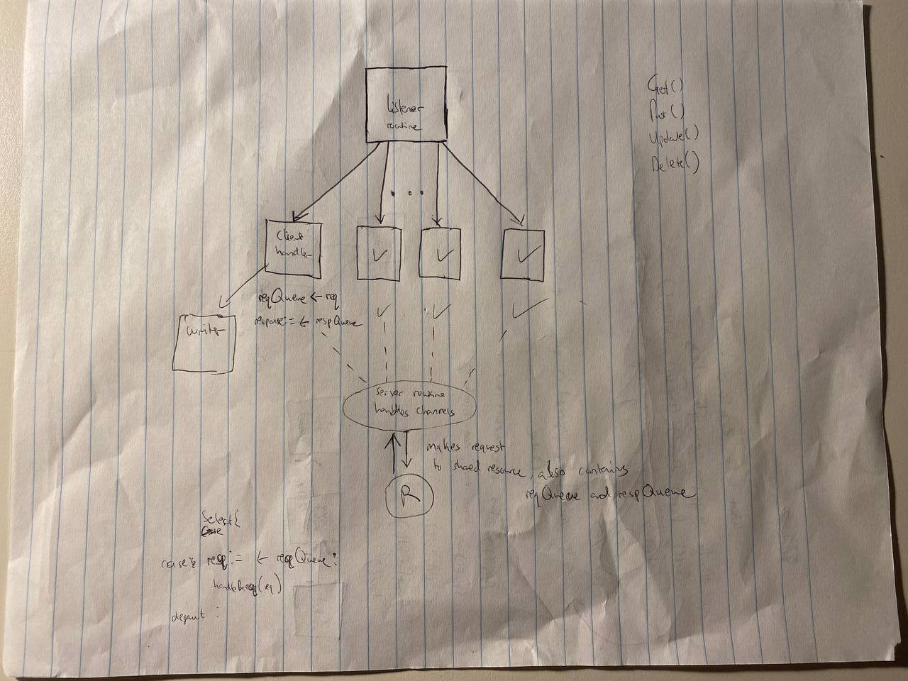

# Project 0: Introduction to Go Concurrency and Testing


## Overview
This is my attempt at Project 0 for the 15-440/640, Distributed Systems course (Fall 2021) at Carnegie Mellon University. The project focuses on exploring basic concurrency patterns and testing strategies using Go.

## Project Summary

### Part A: Key-Value Messaging System Implementation
In Part A of the project, I implemented a key-value database server in Go. This server handles messages where:
- **`Put(K, V)`** function appends a message to the list associated with a key.
- **`Get(K)`** retrieves all messages associated with a key.
- **`Delete(K)`** removes all messages for a key.
- **`Update(K, V1, V2)`** replaces a specified message with a new one under the same key.

The server supports concurrent client connections, managing them with goroutines and channels, and implements functionality to handle slow-reading clients efficiently.

### Part B: Testing Concurrency in a Squarer Implementation
For Part B, I developed tests for a squarer implementation, an object that squares integers read from an input channel and sends the results to an output channel. The focus was on writing tests that could identify concurrency issues in "bad" squarer implementations provided as part of the project setup. This involved ensuring the squarer's behavior conformed to specified behaviors under concurrent conditions.


More information about the assignment is available in the [Assignment PDF](./p0-f21.pdf).

Here's their course website: [course website](https://www.synergylabs.org/courses/15-440/index.html).

## Testing Instructions
To evaluate my server implementation functionality:
```bash
cd src/github.com/cmu440/p0partA
go test
```

To run my squarer test:
```bash
cd src/github.com/cmu440/p0partB
go test
```

## Design Process
Below is a diagram illustrating my thought process for the server implementation. The image shows a listener routine that spawns new read/write client routines once a connection is accepted.

